# Workflow

## Login

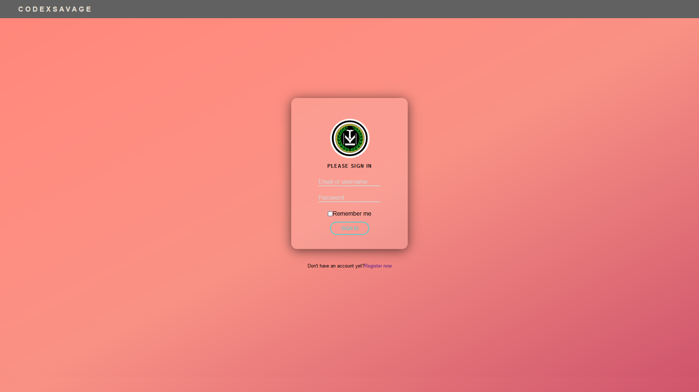

Esta ventana nos permitirá realizar el inicio de sesión de nuestra cuenta, introduciendo las credenciales requeridas. 

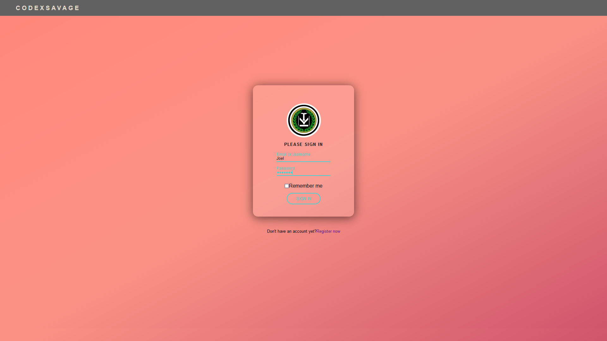
Una vez introducidos los datos correctos, se nos redirigirá a la ventana de *Home* donde se encuentra el programa en sí.
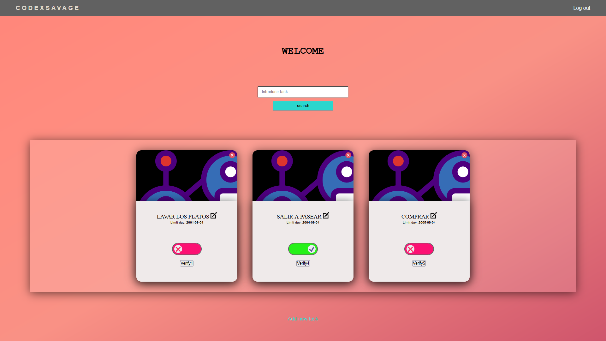

En caso de no tener una cuenta podremos optar por crear una cuenta nueva.

## Home

El cuerpo del archivo html cuenta principalmente con 6 elementos, el banner, el mensajde de bienvenida, el lanzador de alertas,el buscador de tareas, las tarjetas de tareas y el de añadir nuevas tareas

Empezando por el banner, disponemos de dos elementos, el nombre de la marca (*CODEXSAVAGE*) y el link de log out, cada uno de ellos tiens funciones diferentes si se hace click. Cliqueando el nombre de la marca se puede volver a cargar la página, mientras que con la de *log out*, se cierra la sesión. Estas funciones estan presentes en cada una de las ventanas al iniciar sesión, por lo que independientemente de dónde esté siempre se podrá salir o cerrar sesión y volver la página principal.

En cuanto a las targetas de tareas, éstas trabajan de forma independiente, las unas de las otras, aunque el diseño sea el mismo para todas. Muestra, a demás, en aspectos generales, la información más relevante, como el contenido/nombre de la tarea, fecha límite y estado actual, acabado o no. Puesto que el contenido de la tarea se reduce a 25 carácteres, la longitud del nombre de la tarea permite tener, el margen suficiente, para tener siempre a su lado el boton de editar, el cual, al pulsarlo nos redireccionará a la plantilla de editar tarea.  Por último, como se puede apreciar, también cuenta con botón de verificación, que servirá para validar el cambio de estado de la tarea.

Por último el link de añadir tarea nos redireccionará a una nueva plantilla donde nos solicitará la información correspondiente.

## Search task

A la hora de buscar una tarea, es imprescindible que el nombre sea el mismo del que se quiere encontrar, ya que de no ser así no lo mostrará y al trabajar de forma independiente, los botones de submit también lo haran (targeta de tareas y buscador). 

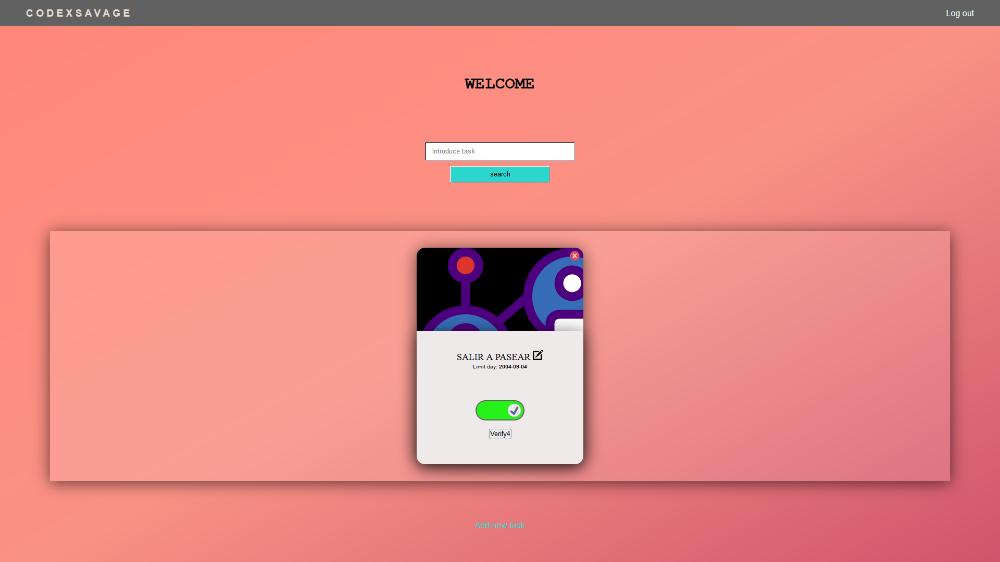

Y al igual que el nombe la marca, si no se introduce ningún valor, también sirve para cargar la página volviéndonos a cargar todas las tareas de nuevo. Es útil cuando al obtener el resultado de una búsqueda en lugar de ir al banner podemos hacerlo desde ahí mismo.

## Estado de la tarea

Como obsevaremos, para cambiar el estado de la tarea sólo será necesario cambiar el estado del toggle, siendo el color rojo, no hecho aún y, verde, hecho. En este caso cambairemos el estado de la tarea con nombre "salir a pasear"

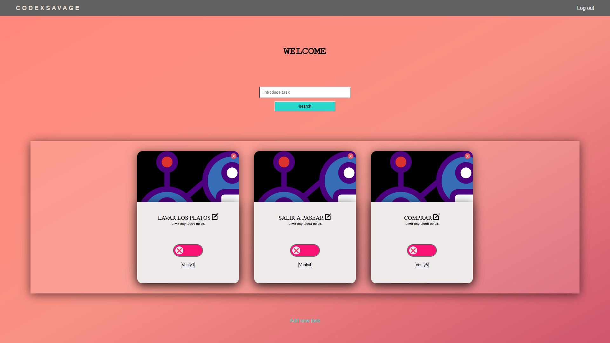
Como vemos al verificar los cambios se nos vuelve a cargar la página con el estado de no hecho.

También podremos ver el cambio en la base de datos:

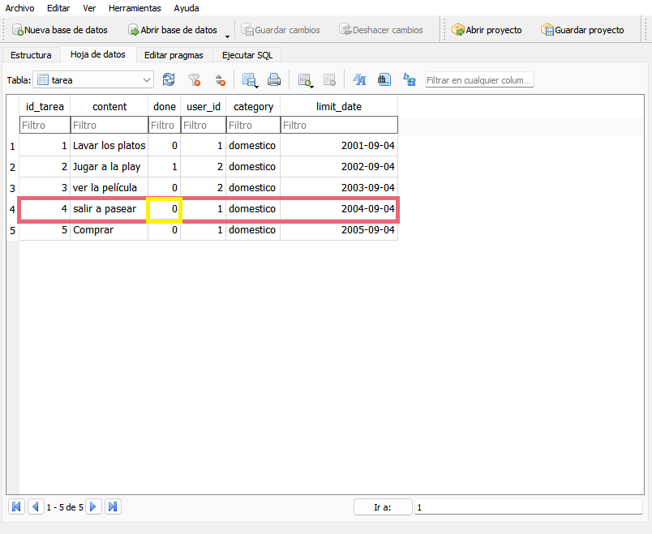

Siendo el original este:

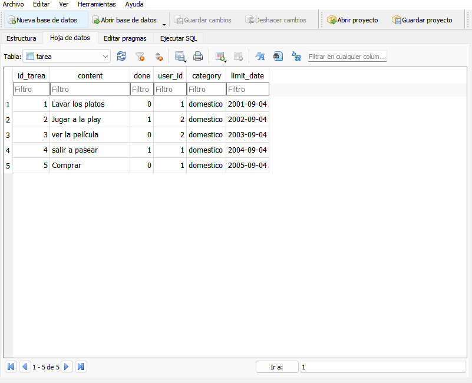

## Edit task

Para editar una tarea como su categoria y fecha limite, será necesario cliquear la imagen de edit, la cual siempre estará al lado del nombre de la tarea y en la misma línea, ya que al limitar el número de carácteres que puede formar el nombre la tarea permite siempre tenerlo de esta forma

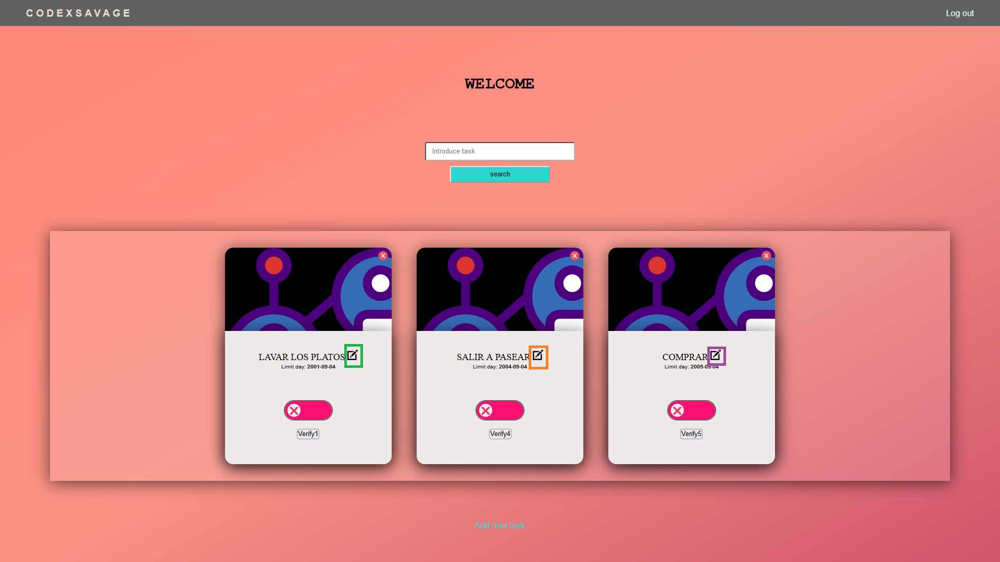

Para este caso vamos a editar el tarea con el nombre "salir a pasear". Como se puede apreciar, se muestran los datos actuales del registro como su nombre(no editable), la categoria y la fecha límite.

Una vez hagamos los cambios pertinentes, y hayamos rellenado todos los campos necesarios, ya que de no ser así, no nos dejará enviar nada, podremos confirmar.

Luego de confirmar los cambios, se nos devolverá a la página principal donde lo veremos reflejado

## Add task

Para añadir una nueva tarea, simplemente haremos click en el link de "Add new task" posicionado en la parte inferior de la página 'Home', la cual nos redirigirá a la página de añadir nueva tarea. En dicha página se nos solicitará introducir todos los datos, de no ser así, no nos dejará enviar nada.

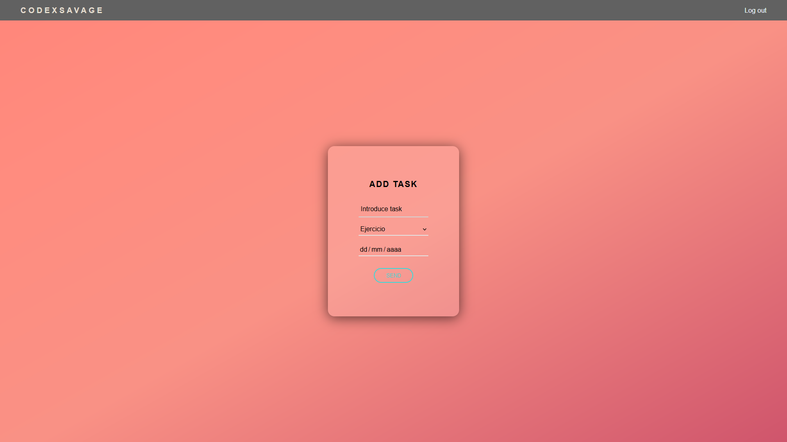

Una vez rellenados todos los campos como la imagen:

Podremos enviar los datos, al instante, se nos redireccionará a la página de 'Home' de nuevo, lugar dónde veremos que se ha añadido la nueva tarea.

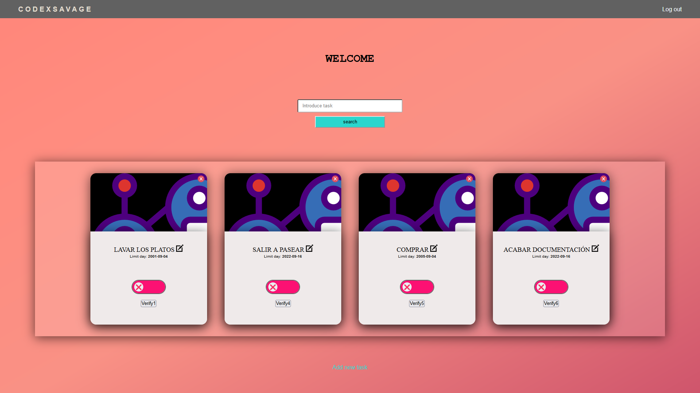

Mientras que en la base de datos se podrá confirmar que se ha añadido una nueva tarea.

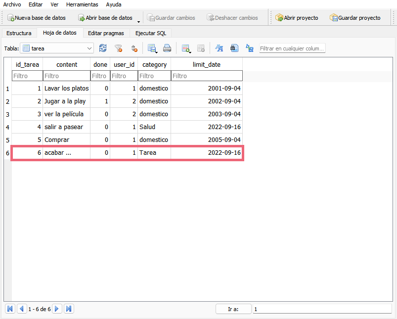

## Delete task

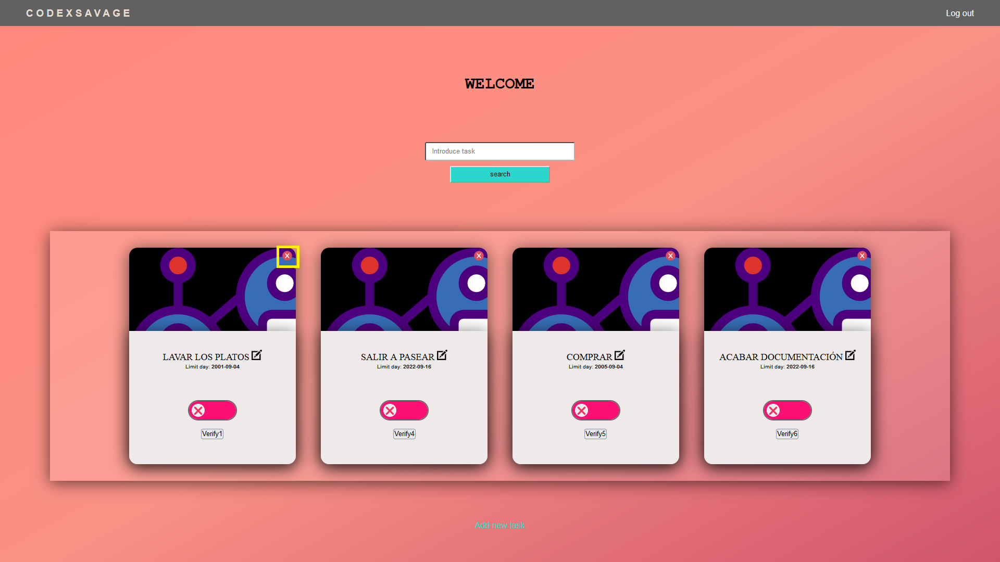

Para eliminar una tarea en concreto, cliquearemos la imagen de la parte superior derecha, con un símbolo de "X", que eliminará la tarea y nos volverá a cargar la página, pero esta vez sin la tarea, ya que estará eliminada de la base de datos.

Mientras que en la base de datos podremos confirmar que la tarea se ha eliminado ya que no se muestra.

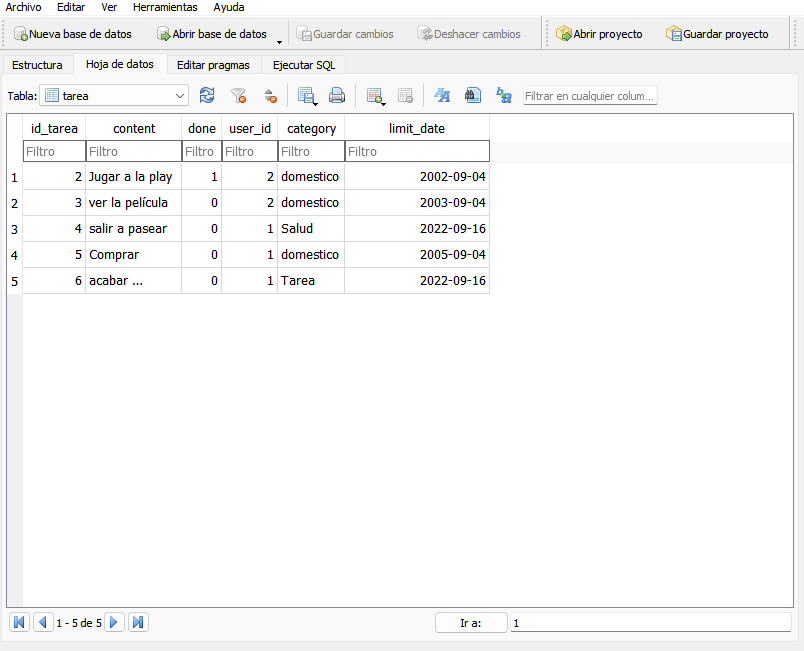
## Register

Para registrarnos como nuevos usuarios, cliquearemos en el link de "Register now", donde se nos redirigirá a una nueva ventana

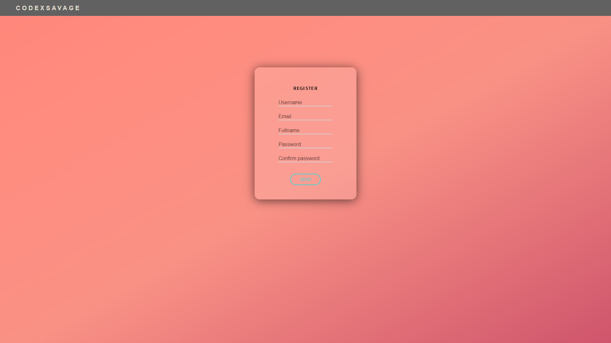

Llenando los datos de la siguiente manera:

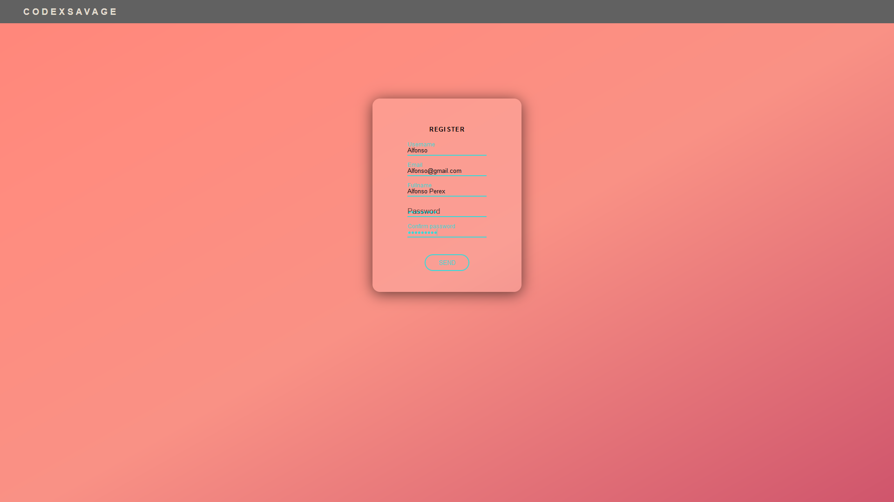

Podremos iniciar sesión con nuestra cuenta creada. De hecho también podremos verlo reflejado en la base de datos de la tabla de usuario.

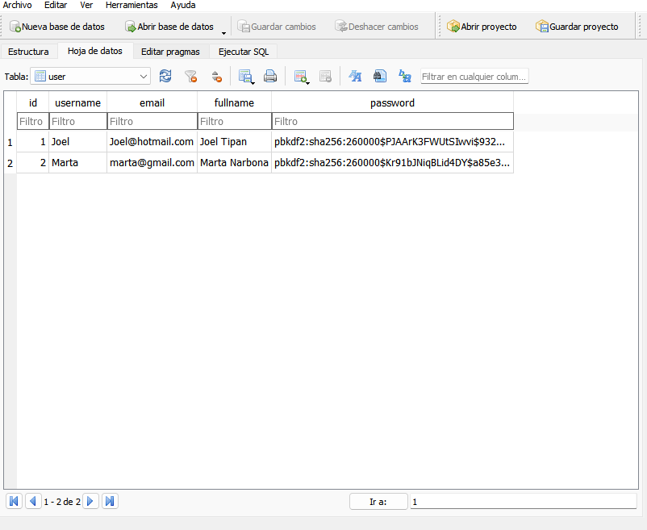

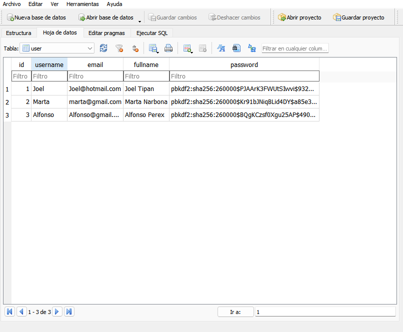

## Terminal

La vista en terminal de lo ocurrido en este flujo de trabajo ha sido el sigueinte sin contar el registro.

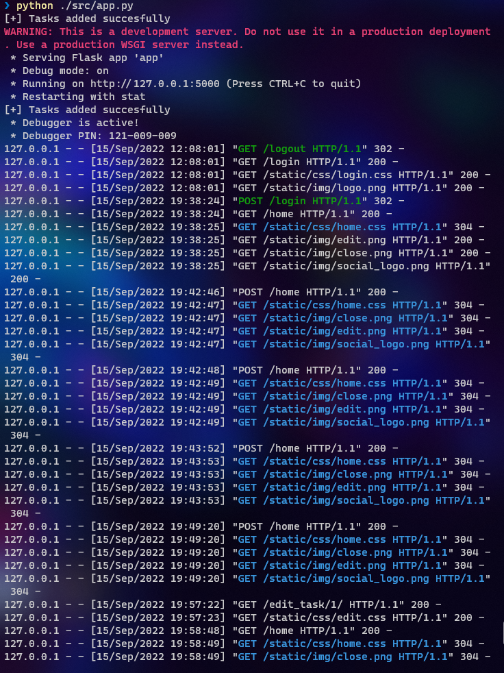
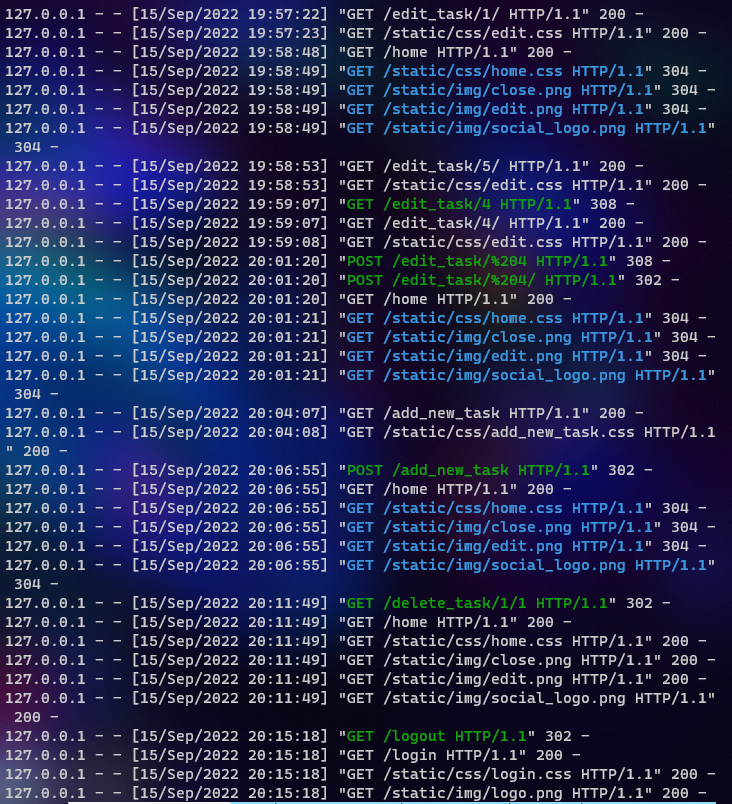