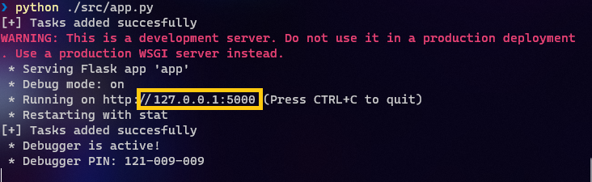

# Flask-Task-Manager
Web application for task manager with Python and Flask

### Prerequirements

* Install Python 3.9.13 or higger.

### Instructions

1. First of all, we have to work in a virtual environment. To do this, we need to install the Python virtual environment.

```bash
				pip install virtualenv

```

2. In our terminal, put the next commands to start our virtual environment:

```bash
				virtualenv -p python3 env

```

The arg 'env' is the name that we decide to put to the virtual environment

```bash
				.\venv\Scripts\activate

```

3. Start the program with the next command:

```bash
				python ./src/app.py
								
```

4. Go to your favourite internet explorer and put the following URL:

```html
				localhost:5000
		
```
Or click the URL that Flask show you when it initilizes.
<center>



</center>
